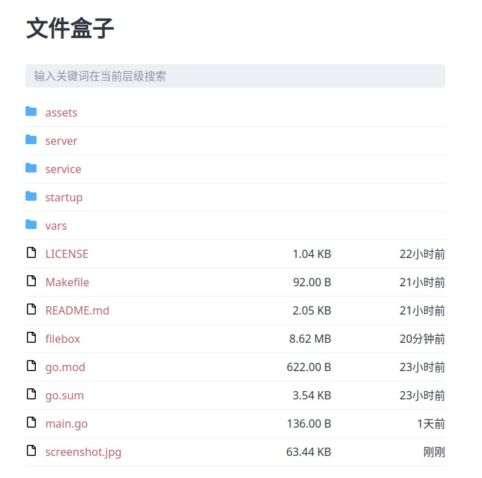

# 文件盒子

文件列表程序 内置 WebDAV 服务器

## 功能

- 文件列表 Web UI
- 内建 Basic Auth 保护的 WebDAV 读写支持
- 安全链接，防止盗链资源刷爆流量
- 自动渲染 README.md
- 可自定义 网站标题
- 可自定义 Favicon

## 构建

构建需要 Golang 1.18 以上环境，已安装 make 命令。最小构建需要安装 UPX。

标准构建方式：`make` 构建产物约为 6MB

最小构建方式：`make mini` 构建产物约为 2.5MB

## 命令行参数

<dl>
  <dt>--listen</dt>
  <dd>指定服务监听的地址，默认为 :9496 端口</dd>

  <dt>--dir</dt>
  <dd>指定服务的文件目录，默认为当前目录</dd>

  <dt>--title</dt>
  <dd>指定网站标题，默认为"文件盒子"</dd>

  <dt>--username</dt>
  <dd>指定 WebDAV 用户名，默认为"admin"</dd>

  <dt>--password</dt>
  <dd>指定 WebDAV 密码，默认为"admin"</dd>
</dl>

## 高级特性

### 文件隐藏

同 Linux 系统传统一致，不在列表中展示 . 开头的目录或文件。
如果通过地址直接输入访问，需要输入正确的WebDAV的用户名密码。

### 安全链接

为了防止文件链接被某些下载工具缓存并持续盗链消耗服务器流量，添加了简单的签名服务，链接过期时间为 5 分钟（300 秒）。
如需修改，请编辑 service.SecureLinkExpireSecond 常量后再构建。

### WebDAV

内建 WebDAV 支持，WebDAV 具有对目录的读写能力，请谨慎使用。
由于 Basic Auth 的密码会明文传送，建议通过 Caddy / Nginx 等支持 HTTPS 的服务器进行反代。

当用户名密码都设置为空时，WebDAV 将不验证任何身份，为了安全应该仅在可信环境内关闭用户名密码。

### README.md

目录页会尝试渲染发现的`README.md`文件，并对其中的链接和图片地址进行签名，使用方无需考虑安全链接问题。

### 个性化

通过命令行参数 `--title` 可以指定网站的标题，仅在首页生效。

通过在目录中安放 `favicon.ico` 文件可以变更网站的图标。